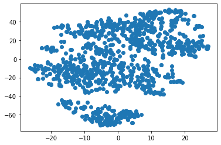
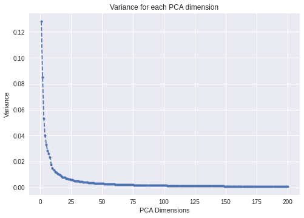

```python
import pandas as pd
import matplotlib.pyplot as plt
import numpy as np
import sys
from sklearn.decomposition import PCA
from sklearn.manifold import TSNE

```


```python
sys.path.append('../src')
import utils

```


```python
labels, features_list = utils.load_features('../data/processed/features_202101182225.csv')
```


```python
df_f.head()
```


    ---------------------------------------------------------------------------

    NameError                                 Traceback (most recent call last)

    <ipython-input-5-e7b3507d424b> in <module>
    ----> 1 df_f.head()
    

    NameError: name 'df_f' is not defined


```python
df_m = pd.read_csv('../data/interim/graphik_portal_202101182225.csv')
df_m.head()
```


<div>
<style scoped>
    .dataframe tbody tr th:only-of-type {
        vertical-align: middle;
    }

    .dataframe tbody tr th {
        vertical-align: top;
    }

    .dataframe thead th {
        text-align: right;
    }
</style>
<table border="1" class="dataframe">
  <thead>
    <tr style="text-align: right;">
      <th></th>
      <th>object_id</th>
      <th>title</th>
      <th>img_url</th>
      <th>detail_url</th>
      <th>detail_description</th>
      <th>img_path</th>
    </tr>
  </thead>
  <tbody>
    <tr>
      <th>0</th>
      <td>3</td>
      <td>Marcus Curtius stürzt sich in die Erdspalte</td>
      <td>https://www.e-gs.ethz.ch/eMP/eMuseumPlus?servi...</td>
      <td>https://www.graphikportal.org/document/gpo0021...</td>
      <td>Monogrammist IB [Nagler III 1950] (Erwähnt um ...</td>
      <td>../data/processed/images/0/3.png</td>
    </tr>
    <tr>
      <th>1</th>
      <td>18</td>
      <td>Die Philister bringen die Bundeslade in den Te...</td>
      <td>https://www.e-gs.ethz.ch/eMP/eMuseumPlus?servi...</td>
      <td>https://www.graphikportal.org/document/gpo0021...</td>
      <td>Battista Franco (Um 1510 - 1561), Um 1525 - 1561</td>
      <td>../data/processed/images/0/18.png</td>
    </tr>
    <tr>
      <th>2</th>
      <td>19</td>
      <td>Der grosse Saal im Schloss in Prag [Linke Bild...</td>
      <td>https://www.e-gs.ethz.ch/eMP/eMuseumPlus?servi...</td>
      <td>https://www.graphikportal.org/document/gpo0021...</td>
      <td>Egidius Sadeler (der Jüngere) (Um 1570 - 1629)...</td>
      <td>../data/processed/images/0/19.png</td>
    </tr>
    <tr>
      <th>3</th>
      <td>33</td>
      <td>Die schöne Försterin</td>
      <td>https://www.e-gs.ethz.ch/eMP/eMuseumPlus?servi...</td>
      <td>https://www.graphikportal.org/document/gpo0021...</td>
      <td>Henry Wyatt (1794 - 1840), nach, 1835, Francis...</td>
      <td>../data/processed/images/0/33.png</td>
    </tr>
    <tr>
      <th>4</th>
      <td>52</td>
      <td>Stigmatisation des heiligen Franziskus</td>
      <td>https://www.e-gs.ethz.ch/eMP/eMuseumPlus?servi...</td>
      <td>https://www.graphikportal.org/document/gpo0021...</td>
      <td>Agostino Carracci (1557 - 1602), Ca. 1583</td>
      <td>../data/processed/images/0/52.png</td>
    </tr>
  </tbody>
</table>
</div>


```python

num_feature_dimensions=100
pca = PCA(n_components = num_feature_dimensions)
pca.fit(features_list)
feature_list_compressed = pca.transform(features_list)
```


```python
# make a color dict
from bokeh.palettes import d3
color_palette = np.array(d3['Category10'][8])
# color_lst = color_palette[df_m['color_map'].to_list()]

num_colors = 8
color_dict = {}
for i in range(num_colors):
    color_dict[i] = d3['Category10'][num_colors][i]
```


```python
# make color categories
color_desc_dict = {0:'general',
                  1:'porträt'}
df_m['color_map'] = 0
#filter for portraits
fltr = df_m['title'].str.lower().str.contains(color_desc_dict[1])
df_m.loc[fltr, 'color_map'] = 1

# map actual colors
df_m['color_map'] = df_m['color_map'].map(color_dict)
```


```python
num_feature_dimensions=100      # Set the number of features
pca = PCA(n_components = num_feature_dimensions)
pca.fit(features_list)
feature_list_compressed = pca.transform(features_list)

num_samples=1000
# For speed and clarity, we'll analyze about first half of the dataset.
selected_features = feature_list_compressed[:num_samples]
selected_class_ids = labels[:num_samples]

tdf = df_m.loc[labels[:num_samples],:]
selected_titles = tdf['title'].to_list()
selected_colors = tdf['color_map'].to_list()

ser_img = tdf.loc[:,'img_url'].str.replace('resolution=superImageResolution','resolution=lowImageResolution')
selected_imgs = ser_img.to_list()[:num_samples]
tsne_results = TSNE(n_components=2,verbose=1,metric='euclidean').fit_transform(selected_features)

# Plot a scatter plot from the generated t-SNE results
colormap = plt.cm.get_cmap('coolwarm')
c=selected_class_ids
cmap=colormap
scatter_plot = plt.scatter(tsne_results[:,0],tsne_results[:,1])
# plt.colorbar(scatter_plot)
plt.show()
```

    [t-SNE] Computing 91 nearest neighbors...
    [t-SNE] Indexed 1000 samples in 0.019s...
    [t-SNE] Computed neighbors for 1000 samples in 0.221s...
    [t-SNE] Computed conditional probabilities for sample 1000 / 1000
    [t-SNE] Mean sigma: 2.634830
    [t-SNE] KL divergence after 250 iterations with early exaggeration: 69.589447
    [t-SNE] KL divergence after 1000 iterations: 1.108566


    

    


```python
from bokeh.plotting import ColumnDataSource, figure, output_file, show,
from bokeh.embed import components

output_notebook()

# output_file("toolbar.html")

source = ColumnDataSource(data=dict(
    x=tsne_results[:,0],
    y=tsne_results[:,1],
    desc=selected_titles,
    imgs=selected_imgs,
    ))

TOOLTIPS = """
    <div>
        <div>
            </img>
        </div>
        <div>
            <span style="font-size: 17px; font-weight: bold;">@desc</span>
            <span style="font-size: 15px; color: #966;">[$index]</span>
        </div>
        <div>
            <span style="font-size: 15px;">Location</span>
            <span style="font-size: 10px; color: #696;">($x, $y)</span>
        </div>
    </div>
"""

p = figure(plot_width=600, plot_height=600, tooltips=TOOLTIPS,
           title="Mouse over the dots")

p.circle('x', 'y', size=10, color='colors', alpha=0.5, source=source)

# export to components
script, div = components(p)

show(p)
```


      File "<ipython-input-21-61f70c95bdbb>", line 1
        from bokeh.plotting import ColumnDataSource, figure, output_file, show,
                                   ^
    SyntaxError: trailing comma not allowed without surrounding parentheses


```python

```


```python
print(div)
```

    
    <div class="bk-root" id="c8bc6831-6f60-4b67-ab96-516993225a37" data-root-id="1246"></div>


```python
pca = PCA(200)
pca.fit(features_list)
plt.style.use('seaborn')
plt.plot(range(1,201),pca.explained_variance_ratio_,'o--', markersize=4)
plt.title ('Variance for each PCA dimension')
plt.xlabel('PCA Dimensions')
plt.ylabel('Variance')
plt.grid(True)
plt.show()
```


    

    


```python

```
